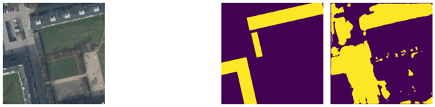
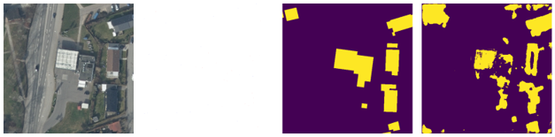
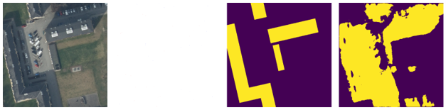
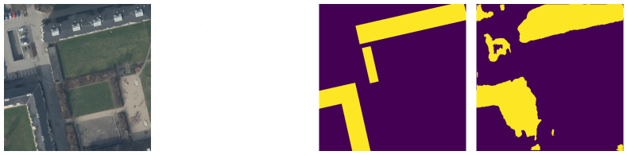
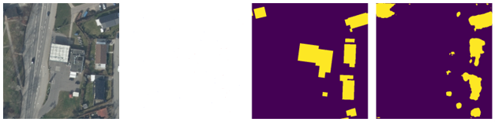
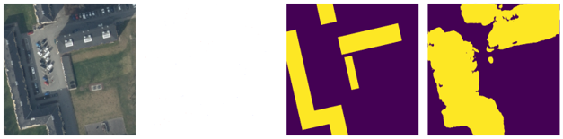

# 🌍 Aerial Point Segmentation Pipeline

[](https://pytorch.org/)
[](https://colab.research.google.com/)

A deep learning framework designed for semantic segmentation on remote sensing and aerial imagery. Instead of relying on expensive, densely annotated masks, this pipeline trains a U-Net architecture using incomplete (sparse) point-based annotations, extracting high-resolution spatial features from minimal data, and evaluates the result with a proper held-out test set rather than training loss alone.

## 🚀 Project Overview

Accurate extraction of building footprints and infrastructure from aerial imagery is a core challenge in geoinformatics and spatial analysis. This project tackles the bottleneck of dataset annotation by implementing a strategy that learns from sparse points rather than full polygon masks, then measures whether that strategy actually holds up under two different experimental conditions.

**Key Methodology:**
* **Environment:** Developed and executed entirely in Google Colab.
* **Architecture:** U-Net with a pre-trained ResNet-34 encoder (transfer learning via `segmentation-models-pytorch`).
* **Data Strategy:** Uses the MapAI aerial dataset. A custom `RealAerialPointDataset` simulates incomplete tagging by sampling *N* points per class and assigning the remainder an `ignore_index=255`.
* **Data Split:** 100 tiles for training, a disjoint 20 tile held-out test set for all quantitative evaluation, and 3 separate tiles reserved for qualitative visualization only.
* **Loss Functions:** Two masked loss formulations were implemented and compared, a Partial Multiclass Focal Loss (alpha 0.25, gamma 2.0) and a Masked Cross Entropy loss, both applying the same `ignore_index` masking so gradients are only computed on the sparsely labeled pixels.
* **Evaluation Metric:** Per-class and mean Intersection over Union (IoU), computed on the held-out test set against the full dense ground truth, not the sparse training points.

## 📊 Experimental Results

Three configurations were trained and evaluated on the same 20 tile held-out test set:

| Condition | Mean IoU | Background IoU | Building IoU | Final Training Loss |
|---|---|---|---|---|
| Focal Loss, 20 points/class | 0.5882 | 0.8047 | 0.3717 | 0.0685 |
| Focal Loss, 100 points/class | 0.5828 | 0.7861 | 0.3794 | 0.0442 |
| **Masked Cross Entropy, 100 points/class** | **0.6858** | **0.8789** | **0.4927** | 0.0001 |

**Two findings came out of this:**

1. **Annotation density had little effect.** Going from 20 to 100 points per class under Focal Loss did not meaningfully change segmentation quality (0.5882 vs 0.5828 mean IoU), despite a clear drop in training loss. Lower training loss did not translate into a better held-out result here, which is the reason this repo reports IoU rather than loss curves as its headline metric.
2. **Masked Cross Entropy outperformed Focal Loss** at the same annotation density (0.6858 vs 0.5828 mean IoU). Note that the loss values themselves are not directly comparable across the two loss functions, Focal Loss structurally produces larger residual values due to its down-weighting term, so only the IoU columns should be used to compare the two.

Full methodology, hypotheses, and discussion are in the accompanying technical report.

## 🖼️ Inference Visualizations

The panels below illustrate Focal Loss model performance on three held-out test tiles, at both annotation densities.

**Columns (Left to Right):** RGB Input | Sparse Annotations | Dense Ground Truth | Model Prediction

### Low Sparsity: 20 Points Per Class
<p align="center">
  
  <br>
  
  <br>
  
</p>

### High Sparsity: 100 Points Per Class
<p align="center">
  
  <br>
  
  <br>
  
</p>

The rounded, blob-like prediction boundaries visible at both sparsity levels are consistent with the building class IoU scores above. The model localizes buildings reliably but does not recover sharp edges at either point density, suggesting the remaining error is a boundary precision limitation rather than an object localization one.

## 🔑 Setup & Authentication

This pipeline programmatically downloads the dataset from Hugging Face. To run the notebook in Google Colab, you must provide your own Hugging Face Access Token.

**In Google Colab:**
1. Open the **Secrets** tab (the 🔑 icon on the left sidebar).
2. Create a new secret named `HF_TOKEN`.
3. Paste your Hugging Face Access Token into the value field.
4. Enable the **"Notebook access"** toggle for the secret.

## 💻 Installation

The notebook requires the following dependencies. Run this block in your first Colab cell to set up the environment:

```bash
!pip install torch torchvision datasets segmentation-models-pytorch
```

## 📄 Technical Report

A full write-up covering the loss formulation, experimental design, hypotheses, and discussion of both findings above is included in this repository as a PDF and Word document.
